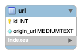

# url-shortener

  
## Tech Stacks
  
 

<br>

## ERD


<br>

## Getting Started
### Prerequisites
`outputs/schema.sql`을 참고하여 데이터베이스를 생성해주세요.

### 웹 애플리케이션
```
git clone https://github.com/SuyeonChoi/market.git
cd market
./gradlew clean bootRun
```
실행 후, `http://localhost:8080/` 접속 시 확인할 수 있습니다.

<br>

## Preview

